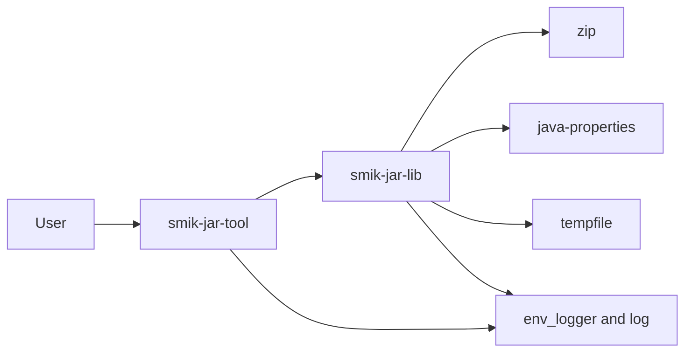
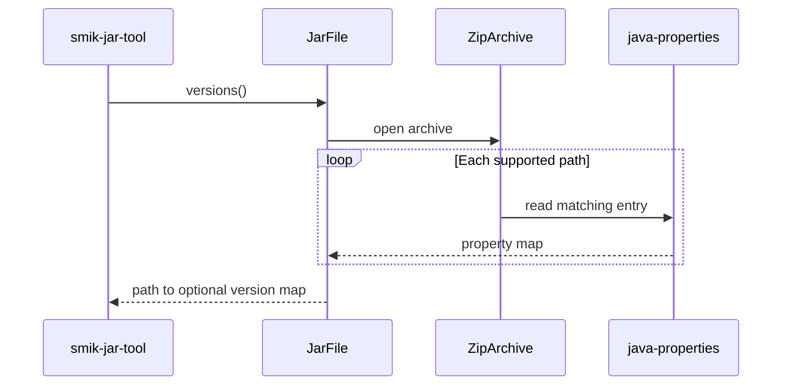
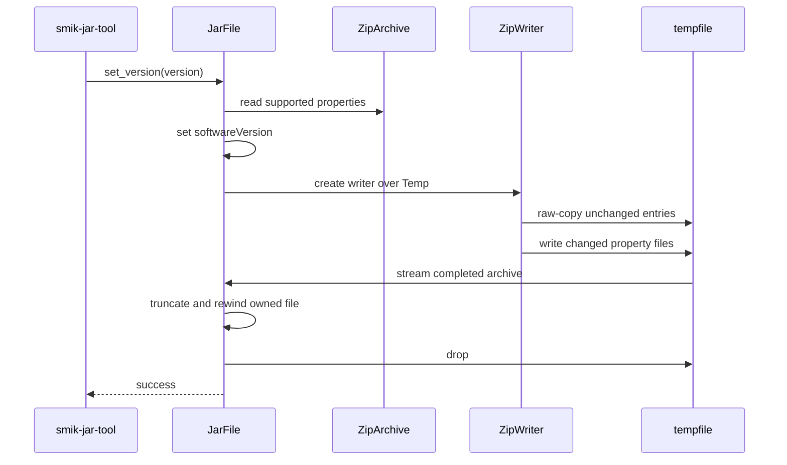

# Architecture

This document describes the internal structure of the `smik-jar-tool`
workspace. The root [`README.md`](README.md) contains user-facing build and
usage instructions.

## Workspace layout

The binary crate owns argument parsing, filesystem access, logging setup, and
exit codes. The library crate owns knowledge of the supported paths, Java
properties parsing, and ZIP archive reconstruction.

All dependency versions and features are declared in the root
`[workspace.dependencies]` table. Member manifests only select the workspace
dependencies they use.

## Library modules

The `smik-jar-lib` crate exposes `JarFile` and `JarError`. Its remaining
modules are implementation details:

| Module | Responsibility |
| --- | --- |
| `lib` | Defines supported property paths and the public crate surface. |
| `jar_file` | Coordinates version reads, archive reconstruction, and persistence. |
| `read_version` | Locates and parses supported Java properties files. |
| `update_jar` | Streams ZIP entries and rewrites changed properties files. |
| `error` | Combines I/O, ZIP, and Java properties failures. |

`JarFile<T>` is generic over its storage. Reading requires `T: Read + Seek`;
updating is implemented for `JarFile<File>`, because replacement requires
truncating the underlying file. The CLI opens its regular file for both reading
and writing when an update is requested.

## Read flow

Missing or malformed supported property files are logged and omitted. Failure
to open the ZIP archive is returned to the caller. Versions are stored in a
`BTreeMap`, giving callers deterministic path ordering.

## Update flow

The writer preserves each replaced entry's ZIP options when available.
Unchanged regular files are copied in their existing compressed form, while
directories are recreated. Unsupported ZIP entry types are skipped with a
warning. ZIP entries cannot generally be resized in place, so the library
reconstructs the archive in an anonymous file created by the `tempfile` crate.
`set_version` then streams the result through the owned file, truncates and
rewinds it, and returns no archive buffer. Dropping the anonymous temporary
file removes it automatically, and the `JarFile` remains available for
subsequent reads or updates.

## Error and logging model

Structural archive errors from `versions` use `ZipError`. Updates use
`JarError`, which retains I/O, ZIP, and Java properties errors as sources.
Recoverable discovery problems, such as an absent supported properties file,
are reported through `log` and do not abort the scan.

The binary translates operation failures into `ExitCode::FAILURE` and emits
the underlying error. Successful reads print versions to standard output.

## Extension points

To support another properties filename, add it to `PROPERTIES_FILES` in
`smik-jar-lib/src/lib.rs`. To support a different archive layout or property
key, update the corresponding path constants or `SOFTWARE_VERSION`. These are
currently compile-time policy choices rather than runtime configuration.

When changing archive reconstruction, preserve the separation between
selection/parsing in `read_version` and ZIP output in `update_jar`. Add tests
covering both retained archive entries and rewritten properties metadata.
